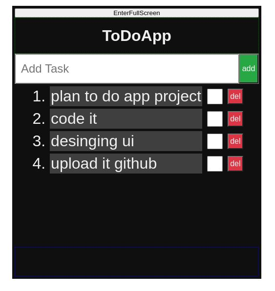

# to-do-app
This is a simple Todo app built with HTML, CSS, and JavaScript.

**Live Preview:** [Todo App](https://moorthid2023.github.io/to-do-app)

## Installation

1. Clone the repository:
2. Open `index.html` in your web browser.
## Usage

- Add new todo items by typing in the input field and pressing Enter.
- Check off todo items by clicking on the checkbox.
- Delete todo items by clicking on the delete button next to each item.

## Contributing
Feel free to open an issue or submit a pull request if you have any suggestions or improvements for the app.
## Contact

If you have any questions or feedback, you can reach me at moorthitechno@gmail.com .

